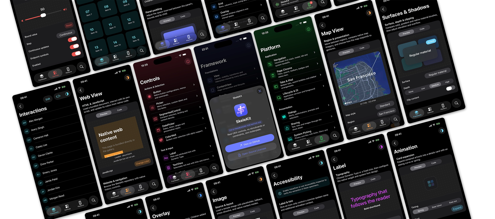

<p align="center">
  
</p>

<h1 align="center">
  SkeleKit
</h1>
<p align="center">
  <a href="https://www.nuget.org/packages/SkeleKit.iOS">
    
  </a>
</p>

<table>
  <tr>
    <td width="99999" align="center">A C# UI framework for native iOS: real UIKit controls, no storyboards or constraints, zero boilerplate.</td>
  </tr>
</table>

<p align="center">
  <a href="https://icysnex.github.io/SkeleKit/motivation/why-skelekit">
    
  </a>
  <span> ˙ </span>
  <a href="https://icysnex.github.io/SkeleKit/getting-started/installation/using-template">
    
  </a>
  <span> ˙ </span>
  <a href="https://icysnex.github.io/SkeleKit/guides/foundations/views-and-view-trees">
    
  </a>
  <span> ˙ </span>
  <a href="https://icysnex.github.io/SkeleKit/reference">
    
  </a>
</p>

---

<h3 align="center">
  About
</h3>

SkeleKit is for C# developers who want native-feeling iPhone and iPad apps without leaving the .NET ecosystem or giving up familiar view trees, bindings, commands, and ViewModels.

SkeleKit is **not** trying to draw a cross-platform imitation of iOS, **it is** pure UIKit under the hood. You write plain C# view trees while SkeleKit handles the annoying parts like layout, composition and application setup. UIKit still provides the controls, rendering and interaction - and remains available whenever you need the native APIs.

SkeleKit deliberately focuses on iOS and iPadOS at the moment. It builds on the nativ e**.NET for iOS** bindings and does not depend on MAUI. If you need one shared UI across several platforms, a cross-platform framework will probably make more sense.

<h3 align="center">
  Getting Started
</h3>

```bash
# Install the template and create an app:

dotnet new install SkeleKit.Templates
dotnet new skelekit-ios -n MyApp
```

```csharp
// A simple MVVM counter view looks like this:

[Page]
public sealed class MainView : ContentView<MainViewModel>
{
    public MainView(MainViewModel viewModel) : base(viewModel)
    {
        Content = new StackPanel
        {
            Spacing = 4,
            VerticalAlignment = VerticalAlignment.Center,

            Children =
            {
                new Label
                {
                    Text = Bind(vm => vm.Count)
                        .ConvertTo(val => $"Count: {val}")
                },

                new Button
                {
                    Text = "Click me",
                    Command = viewModel.ClickCommand
                }
            }
        };
    }
}
```

SkeleKit currently requires the .NET 10 iOS workload and targets iOS 18 or later. The [Getting Started guide](https://icysnex.github.io/SkeleKit/getting-started/installation/using-template) covers setup, project structure, hot reload, and the first app; the [guides](https://icysnex.github.io/SkeleKit/guides/foundations/views-and-view-trees) cover the rest of the framework.

---

<p align="center">
  
</p>

<table>
  <tr>
    <td align="center">
      <strong>Native UIKit</strong>
      <br>
      Controls wrap UIKit types directly. SkeleKit owns composition and layout, never rendering.
    </td>
    <td align="center">
      <strong>Clean C# syntax</strong>
      <br>
      Define view trees with object initializers instead of XAML, view controllers or Auto Layout constraints.
    </td>
    <td align="center">
      <strong>Full AOT compatible</strong>
      <br>
      Bindings avoid reflection, expression trees, and runtime code generation.
    </td>
    <td align="center">
      <strong>Application services</strong>
      <br>
      Navigation, DI, Dynamic Type, safe areas and keyboard avoidance are integrated.
    </td>
  </tr>
</table>

---

> [!NOTE]
> SkeleKit is an early preview. It can be used to build complete apps, but APIs may change before 1.0.
